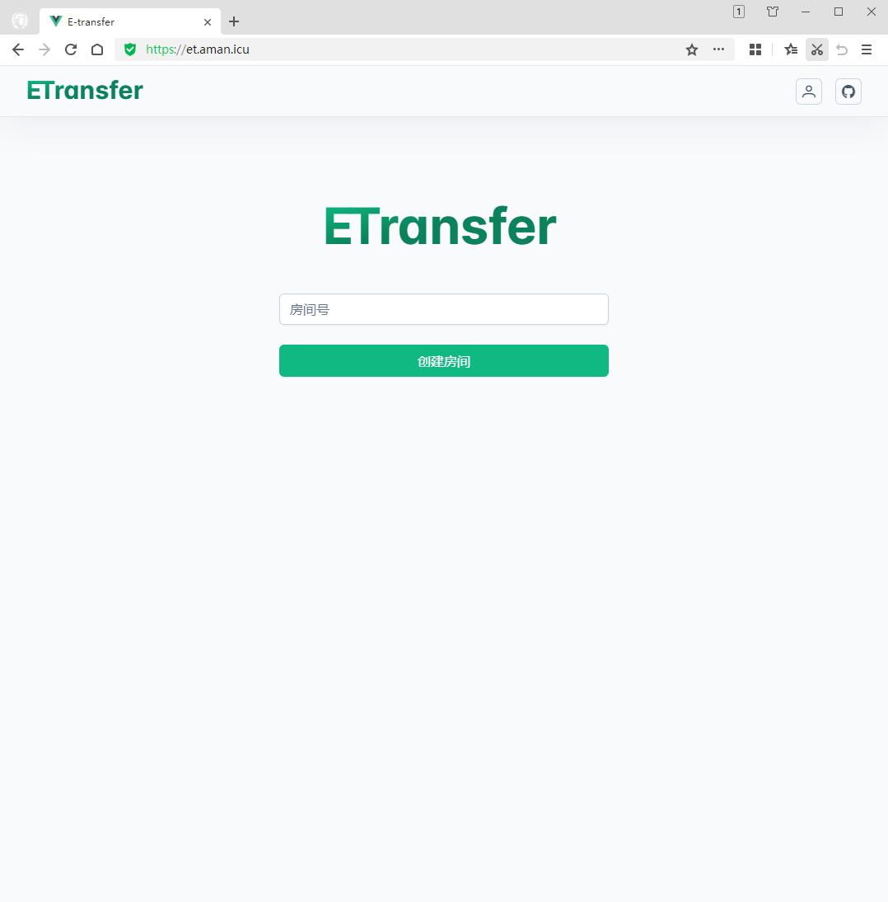
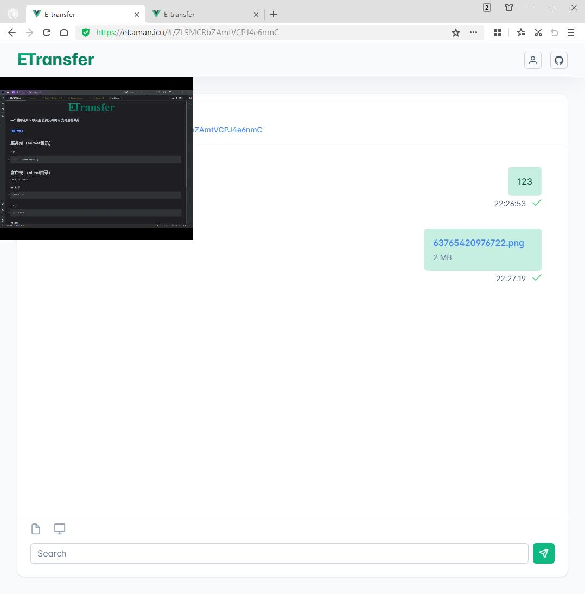

<div align="center">

</div>

### ETransfer - 一个简单的P2P聊天室


### 功能列表
* 文字聊天
* 图片粘贴
* 文件传输
* 屏幕共享

### TODO
* 语音通话
* 视频通话

### DEMO
##### [示例网站](https://et.ddwhm.com)
<div>


</div>


## 服务端（server目录）

### 安装
```shell
cd ./server && npm install
```
### 运行
```shell
node  ./server/server.js
```

## 客户端 （client目录）
Vue3 + PrimeVue

### 安装
```shell
cd ./client && yarn install
```

### 运行
```shell
cd ./client && yarn serve
```

### 编译
```shell
cd ./client && yarn build
```

